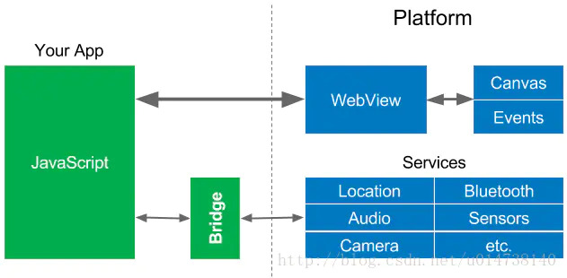

# 跨平台移动开发技术框架

多年前我们开发一个应用程序需要考虑产品将涵盖哪些移动操作系统：Android、iOS、微软、RIM或Symbian。而今天，Android和iOS占据了移动操作系统市场份额的98%。覆盖什么平台不再是问题，问题是，构建一个可以在两个平台上都可以使用的应用程序应该采用什么方法？这就是我们下面讨论的跨平台移动开发技术框架。

从技术发展上讲从最开始以Cordova为基础的Hybrid混合开发技术，到React Native的桥接技术，到现在新兴的Flutter自渲染技术，跨平台开发技术一直在演进。

下面分别介绍一下目前主流的跨平台移动开发技术框架：

- Ionic
- Cordova
- React Native
- Xamarin
- Flutter
- Weex

### Cordova

Cordova 是Apache旗下的一个开源的移动开发框架。它允许你使用web开发技术（HTML5、CSS3、JavaScript）进行跨平台开发。应用在每个平台的封装器中执行，并且依赖规范的API对设备进行高效的访问，比如传感器、数据、网络状态等等。

Cordova 是Hybrid开发的代表，通过对HTML、CSS、JS封装为原生App。主要依赖于WebView。Cordova将不同设备的功能，按标准进行了统一封装，开发人员不需要了解设备的原生实现细节，并且提供了一组统一的JavaScript类库，以及为这些类库所使用的设备相关的原生后台代码。因此实现了“write once, run anywhere”(一次开发，随处运行)。

Cordova前身是PhoneGap（2008年推出的一个采用HTML，CSS和JavaScript的技术，创建移动跨平台移动应用程序的开发框架）。2011年Adobe公司将其收购对其开源，并捐献给Apache，重新命名为Cordova。

### React Native

React Native让开发者使用JavaScript和React编写应用，利用相同的核心代码就可以创建Web,iOS和Android平台的原生应用。React Native着力于提高多平台的开发效率-----仅需学习一次，编写任何平台（Learn once, write anwhere）。

React Native支持标准平台组件使用，在iOS平台我们可以使用UITaBar控件，在Android平台我们可以使用rawer控件。这样App从使用上和视觉上拥有像原生App一样的体验。

2015年9月15日，Facebook发布了React Native for Android，把Web和原生平台的JavaScript开发技术扩展到了Google的流行移动平台。

### Flutter

在2017年的谷歌I/O大会上，Google推出了Flutter，Flutter是面向iOS和Android应用，提供一套基础代码（使用Dart语言）的高性能高可靠软件开发工具包，使开发者能够在iOS和Android两个主要的移动平台上，打造统一代码的高性能应用。

Flutter能够在iOS和Android上运行起来，依靠的是一个叫Flutter Engine的虚拟机，Flutter Engine是Flutter应用程序的运行环境，开发人员可以通过Flutter框架和API在内部进行交互。

## 移动端跨平台开发技术演进

以Cordova为代表的Hybrid开发，主要依赖于WebView。但是WebView是一个很重的控件，很容易产生内存问题，而且复杂的UI在WebView上显示的性能不好。JS与Native代码之间的通信需要使用JSBridge进行上下文切换，因此会降低一些性能。

React Native技术抛开了WebView，利用JavaScriptCore来做桥接，将JS调用转为native调用，只牺牲了小部分性能获取的跨平台开发，这是一大步进步。但是由于依然存在一个从JS代码到原生代码的转化过程，在界面UI被频繁操作的情况下，可能会导致性能问题。

https://www.jianshu.com/p/900bf9cbd005
https://www.jianshu.com/p/8e99b4aed464

很多年来，从移动操作系统到应用程序开发者，在Write Once, Run Anywhere 这件事情上做了大量的尝试和实践，发展到现在就国内的情况来讲基本上有三个技术方向，Web App，Hybrid App，Native App。

因为具有更大规模用户体量的产品，在技术上有更有纵深，所以基本上会成为技术选型的风向标

https://www.cnblogs.com/windfic/p/10443342.html
https://gitchat.csdn.net/columnTopic/5a5335399e07553a5463e3d8